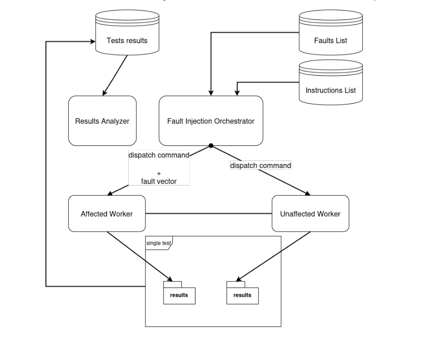
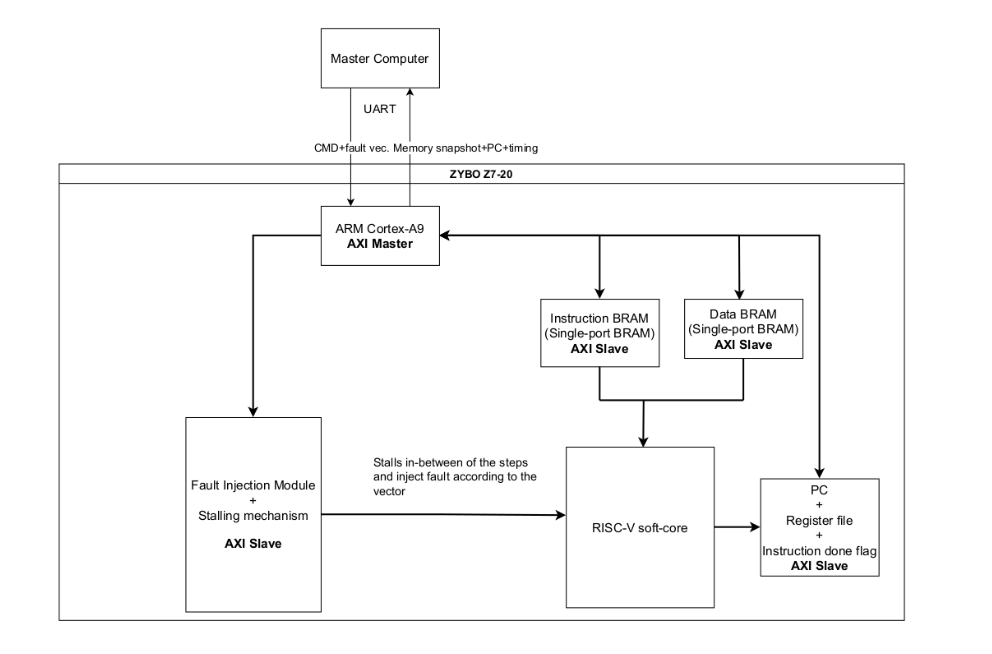

# RISCV-Research-Project
This repository contains a framework for injecting artificial SEU faults into RISC-V core. This work was done as a part of ISAE Supaero Master Aerospace Engineering degree.

## Project's overview
RISC-V is an open-source Instruction Set Architecture. Due to its non-proprietary nature its adaptation to space industry offers great costs cut related to the lack of any licensing. 

Central Processing Units that operate in the space environment are subjected to different kinds of radiation. A very common case is the exposition to an ionizing radiation which interacts with electrical components of satellites on Earth's orbit. A physical phenomena known as [Single Event Upset (SEU)](https://en.wikipedia.org/wiki/Single-event_upset) can result in a bit flip within CPU's memory, register file causing incorrect execution of a running software. Reprecussions of such an accident can be fatal to the mission.

This project focuses on two goals:

1. Adapting RISC-V architecture to the space environment with respect to SEU: applying hardware mitigation techniques.
2. Establishing a generic test framework within Zybo line of ARM/FPGA SoC platforms, which injects simulate SEU faults and analyzes outputs to evaluate mitigated core performance. The framework should allow for a verification of different cores as long as they can synthesize on the supported platform with minial changes (mostly ports expositions).

### Architecture
The proposed architecture uses [Digilent Zybo Z7-20](https://digilent.com/shop/zybo-z7-zynq-7000-arm-fpga-soc-development-board/) development boards and a master computer (later called as Master PC).

#### High Level Architecture
The idea is to have two workers (Zybo boards) one implements mitigated core, another one unmitigated. Both workers communicate with the Master PC (on the diagram below Fault Injection Orchestrator) which sends to them what kind of instruction to execute and what kind of fault to inject.



The outputs from cores are collected and compared against each other to establish, if mitigation worked and what was the time performance of the mitgated CPU.

#### Detailed Single Worker Architecture
The detailed aritecture of a single worker is depicted below. Master PC sends commands through UART, which is received by built-in Zybo ARM Cortex CPU. ARM Cortex implements AXI Master which interprets requests from Master PC and does the following:

1. Modify instruction memory of the core with a new instruction.
2. Inform Fault Injection Module (FIM) about the fault to inject (into register file, instruction memory, data memory).
3. Once FIM confirms injection the ```unstall signal``` is issued and the core executes the instruction. In the meantime a timer is launched to measure how long it takes to complete the instruction.
4. When ```instruction done signal``` is issued back, then ARM ```stalls``` the processor, collects memory, register file snapshots and program counter (PC) and sends all that information back to the Master PC.

Entire communication between Programmable Logic (PL) and Processing System (PS)- ARM, is done through [AMBA AXI](https://www.amd.com/en/products/adaptive-socs-and-fpgas/intellectual-property/axi.html) protocol.



Component labeled as RISC-V soft-core is meant to be any core that can synthesize on the supported hardware like Zybo Z7-20. The principal advantage of this approach is that this architecture can mimick debugger workflow without having to implement full debug mode within the core (greately simplyfying it) and inject SEU into the processor.

## Development
The project's tree in the simplified form form looks as follows:
```
├── cores
├── docs
├── masterpc
└── soc
```

* ```cores```: contains HDL implementations of soft-cores to verify + any build system they use
* ```masterpc```: Master PC application
* ```soc```: ARM Cortex application + full implementation including the selected core