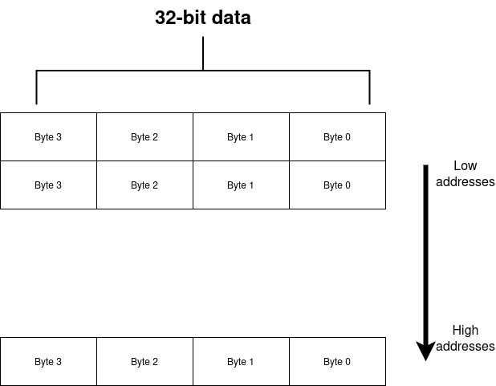

# riscv_single_core

## Overview

FPGA (Verilog based) implementation of a single core, unpipelined (and single cycle), 32-bit RISC-V processor, according to RV32I.
Key features:

- 37 instructions
- machine mode only
- single-cycle, unpipelined
- CSRs, interrupts, timers and exceptions are not supported for simplicity

### Instructions

1. Integer arithmetic (register–register and immediate)

    ```ADD, SUB, SLT, SLTU, AND, OR, XOR, SLL, SRL, SRA```

    1.1 Immediate forms:

        ```ADDI, SLTI, SLTIU, ANDI, ORI, XORI, SLLI, SRLI, SRAI```

1. Load and store

    Loads: ```LB, LH, LW, LBU, LHU```

1. Stores: ```SB, SH, SW```

1. Control transfer (branches and jumps)

    Conditional branches: ```BEQ, BNE, BLT, BGE, BLTU, BGEU```

1. Jumps: ```JAL, JALR```

1. Unconditional: ```AUIPC, LUI```

### Registers

Registers mapping (by default)

|          |               function              |
|:--------:|:-----------------------------------:|
| ```x0``` | hard-wired to ```32'b0```           |
| ```x1``` | ```ra```: return address for a call |
| ```x2``` |       ```sp```: stack pointer       |
| ```x5``` |       alternate link register       |

Each register is 32-bit.

### Memory

This project utilizes byte addressable memory layout. It uses very simple custom implementations of dual-port BRAMs for both data and instructions. Due to the single-cycle nature of this core both BRAMs work within a single cycle which is more a wishful thinking than the reality.



#### Writing testbenches

In order to test the core a RISC-V 32-bit assembly program has to be written. The program should be stored in a respective directory for instance: `data/s_type/`.

After creating program it has to be compiled and turned into `.hex` file.
In order to do so, use the Python script located in `data/` as below (adjust the path obviously):

```bash
cd data
python3 rv322coe.py --file s_type/sb/program.S
```

It doesn't require any special environment, only the RISC-V compiler (`riscv64-unknown-elf`).

In addition to the assembled program (`program.hex`), each folder must contain:

- a memory (`memory.hex`) file as well which file will be used to initialize data memory.
- a file with the expected state of the registers (`expected_registers.hex`), against which the final state of the CPU is checked.
- a file with the expected state of the memory (`expected_memory.hex`), against which the final state of the memory is checked.

The test is automatically discovered by the Makefile.

### Running simulation and build

The simulation environment can be either Vivado or [IVerilog](https://github.com/steveicarus/iverilog).

In order to compile and run simulation using IVerilog (faster way) execute:

- for RISC-V instructions: ```make instruction_type/instruction``` , like: ```make b_type/beq```
- for core's component: ```make component_tb``` , like: ```make pc_tb```

In order to use Vivado simulator execute:

- for running only one, specific testbench: ```make sim-vivado TB=testbench_name```
- for running multiple specific testbenches: ```make sim-vivado TB="tb_1 tb_2...```
- for running all avaliable testbenches: ```make sim-vivado```

In either case the results (waveforms and output file) will be solved inside ```simulation/``` directory.

This project currently doesn't synthesize, however in order to build it execute:
```make bit```

### Target

The target device for this project is [Zybo Z7: Zynq-700](https://digilent.com/reference/programmable-logic/zybo-z7/start). Although this code is not syntesizeable.

### Credits

This work was done under and influence and an immense guidelines of [HolyCore](https://github.com/0BAB1/HOLY_CORE_COURSE). Thank you Hugo for the support <3
