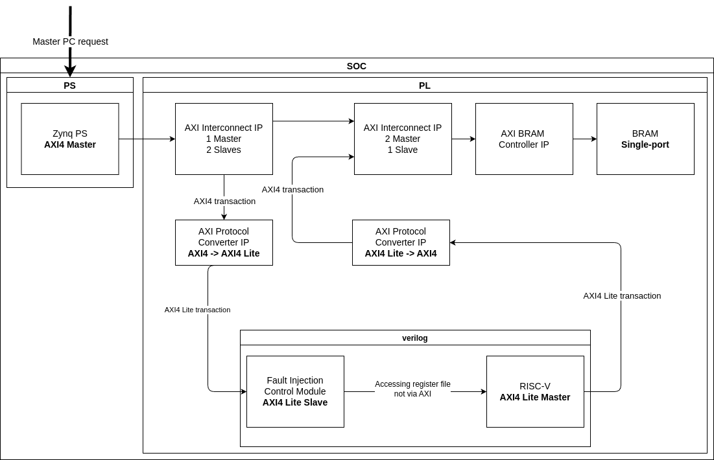

# SOC
This directory contains the sources for and build utilities for the final product- synthesizeable diesign, which includes:

- ZYNQ Processing System C application (AXI Master)
- PS-PL joint project in Vivado (it instantiates the design with the core of choice and all necessary IP cores)
- IP cores directory

## Architecture
The diagram below was created in accordance to [High Level Architecture and Detailed Single Worker Architecture](../README.md). It clarifies, which components belong to Processing System (PS) and which to Porgrammable Logic (PL)- implemented in HDL. Several indicated IP cores: AXI Interconnecct, AXI BRAM Controller, AXI Protocol Converter belong to AMD IP Cores Library. RISC-V IP is the custom made IP Core which integrates the core of choice with Fault Injection/Controll Module.



## PS-PL joint project
### General
This is Vivado project which defines the connections between HDL part of the project and the software part of the project. The project can be recreated thanks to ```RISC_V_softcore.tcl```. To do so run:

```vivado -mode gui -source RISC_V_softcore.tcl```

This command will create ```RISC_V_softcore/``` directory and inside it Vivado will regenerate the project.

### Development
The build system utilizes both TCL scripting for Vivado (PL layer) and Vitis Python API for Vitis (PS layer, full integration).

In ```soc/``` directory ```scripts/``` directory contains three scripts necessary to:

- build RISC-V IP Core: ```scripts/package_riscv_ip.tcl```
- synthesize and implement entire PL layer and export ready design into ```xsa```: ```scripts/build_riscv_worker_pl.tcl```
- compile PS layer of the system using exported ```xsa``` and initialize Vitis project: ```scripts/build_riscv_worker_ps_pl.py```

Additionally, as a safe check there's also ```soc/RISC_V_worker_PL_layer.tcl```, which can be used to regenerate Vivado project in GUI mode to graphically prepare the block diagram.

Those scripts can be called in an automatic and customized way from ```Makefile``` which resides inside ```soc/``` directory.

Complete the ```Makefile``` according to selected RISC-V IP Core, target and board parts, microcontoller cpu, location of C code etc...

```make
# Project details
# RISC-V IP Core
CORE         := rv32i # this should correspond to the directory inside cores/ from 
                      # which RISC-V IP Core is to be fetched
IP_NAME      := risc_v_32i_cm # name of the IP Core inside the block diagram
IP_VENDOR    := ISAE
IP_LIBRARY   := user
IP_VERSION   := 1.0

# Hardware information
TARGET_PART  := xc7z020clg400-1
BOARD_PART   := digilentinc.com:zybo-z7-20:part0:1.2

# Vivado (PL layer)
PROJECT_NAME := RISC_V_worker_PL_layer
HW           := riscv_worker_hardware.xsa

# Vitis (PS layer)
WORKSPACE    := vitis_ws
PLATFORM     := RISC_V_worker_PS_layer_platform
CPU          := ps7_cortexa9_0
APPLICATION  := RISC_V_worker_PS_application
CODE         := zynq # this directory has to contain the src/ and include/ directory
                     # with the source code that Vitis will copy inside its project
                     # and compile
VERBOSITY    := 1
```
Use ```make``` to invoke the following targets which effectively call scripts described above:

- ```make riscv_ip```: builds RISC-V IP Core based on Makefile configuration
- ```make riscv_worker_pl```: builds full PL layer
- ```make riscv_worker_ps```: builds full PS layer based on the current XSA file (instantiates Vitis project)
- ```make all```: builds everything
- ```make clean_riscv_ip```: removes ```ip_repos/```
- ```make clean_riscv_worker_pl```: removes ```build_riscv_worker_pl/```
- ```make clean_riscv_worker_ps```: removes ```vitis_ws/```
- ```make clean```: removes all directories above

It is possible to to use GUI version for Vivado Block Diagram Project, which eases modifications which have to be done to ```scripts/build_riscv_worker_pl.tcl``` in order to modify the design. Run from ```soc/```:

```vivado -mode gui -source RISC_V_worker_PL_layerl.tcl ```

Then modify the desing and once completed do: *File->Project->Write TCL*, then check: *Copy sources to new project* and *Recreate Block Designs using TCL*. Finally, overwrite the file. Finally you can open newly generated script and copy-paste relevant parts of it inside ```scripts/build_riscv_worker_pl.tcl```.


**Remarks:** 
- currently Vitis automatization is not yet perfect: Vitis project copies files from ```zynq/``` therefore making a copy which doesn't update when sources in ```zynq/``` update or the other way around. This has to be resolved. Only files from ```zynq/``` are included into the repository, so it is important to keep them up to date. So far in order to regenerate Vitis project with updated sources its directory ```vitis_ws/``` has to be deleted and the script re-executed.

#### TODO
- fix ```scripts/build_riscv_worker_ps_pl.py``` so it either deletes and properly retargets the new application component with new sources from ```zynq/``` or use other kind of magic to solve it. **NOT YET DONE**
- combine entire workflow into Makefile targets **WAITING FOR VALIDATION**
